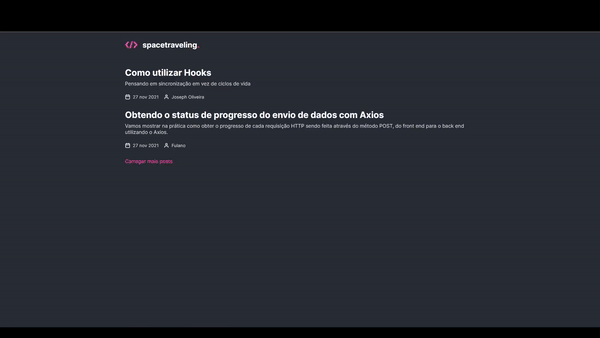

# Criando Um Projeto do zero com Reactjs

<h1 align="center">
    
</h1>

<br>

### 💻 Sobre a Aplicação Criando Um Projeto do zero com Reactjs

Essa será uma aplicação onde o principal objetivo é criar um blog do zero. Receber
uma aplicação praticamente em branco que e consumir os dados do Prismic é uma
Headless CMS para gerar documentos repetíveis (post) que vão retornar alguns dados
para a aplicação e ter a interface implementada conforme o layout do Figma e
desafio um do capítulo 3 do bootcamp.

O que foi feito:
- Estilizações global, comun e individuais;
- Importação de fontes Google;
- Paginação de posts;
- Cálculo de tempo estimado de leitura do post;
- Geração de páginas estáticas com os métodos `getStaticProps` e `getStaticPaths`;
- Formatação de datas com `date-fns`;
- Uso de ícones com `react-icons`;
- Requisições HTTP com `fetch`;
- Preprocesoor SCSS arquivo de estilo global;
- Utilizar variaveis no SCSS para manipular a paleta de cores do projeto;
- Reset CSS removendo possíveis inconsistências entre navegadores diferentes;
- Sistema de arquivos do projeto separado por pasta;
- Entre outros;


Aplicado meu conhecimento em reactjs com base do bootcamp Ignite da Rocketseat
conceitos de forma prática nesse projeto, com os modulos:

- Fundamentos do ReactJS;
- Fundamentos do Next.js;
- Back-end no front-end;
- Front-end JAMStack;


## 🛠 Ferramentas

Aplicação desenvolvida usando as seguintes tecnologias:

- [Typescript](https://www.typescriptlang.org/)
- [ReactJS](https://pt-br.reactjs.org/)
- [Next.js](https://nextjs.org/)
- [Prismic](https://prismic.io/dashboard)
- [React icons](https://react-icons.github.io/react-icons/)
- [Date fns](https://date-fns.org/)
- [Sass](https://sass-lang.com/)
- [Jest](https://jestjs.io/pt-BR/docs/tutorial-react)

###  Programas e configurações necessárias
- Instalar LTS Node versão;
- Instalar um um editor de código-fonte recomendação Visual Studio Code;
- Criar uma conta prismic;
- Configurar prismic para postar posts na aplicação;
- Criar arquivo `.env.local` na raíz do projeto com variavel ` PRISMIC_API_ENDPOINT= `
 e com a url da sua API;


- [Protótipo do projeto acess o Figma](https://www.figma.com/file/0Y26j0tf1K2WB5c1ja5hov/Desafios-Módulo-3-ReactJS/duplicate)
- [Bootcamp Ignite - Rocketseat](https://www.rocketseat.com.br/ignite)

## 🚀 Iniciar Aplicação

>Clone o projeto e acesse a pasta.

```bash
$ git clone https://github.com/felipe-gomes-vicente/reactjs-criando-um-projeto-do-zero.git
$ cd reactjs-criando-um-projeto-do-zero
```
___


> Instalar dependências e iniciar projeto

```bash
$ yarn
$ yarn dev
```
___


> Iniciar Tests unitarios

```bash
$ yarn test
```
___

## 📝 Licença

Esse projeto está sob a licença MIT. Veja o arquivo [LICENSE](LICENSE.md) para mais detalhes.


---

<p align="center">Feito com 💜 by Felipe Vicente👋</p>

- ## My LinkedIn - [](https://www.linkedin.com/in/felipe-gomes-vicente/)
